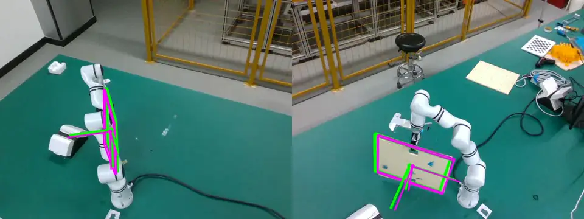
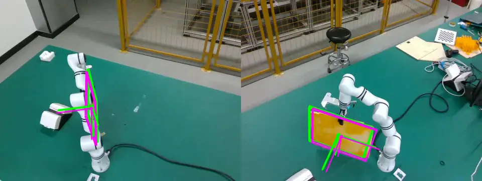

# CAD2Assembly: Assembly Skill Acquisition via LLM-Guided Physical Search and Model-Free 6D Pose Registration for Human–Robot Collaboration

CAD2Assembly converts distributed engineering information from CAD models, assembly documents, and workspace observations into physically verified and spatially grounded assembly skills for human–robot collaboration.

The framework contains two main computational modules. **PhyD2A** extracts part relationships, connection types, operations, and priorities with a Large Language Model (LLM), then uses this information to guide physics-based disassembly search. Feasible disassembly sequences and trajectories are reversed to obtain assembly sequences and paths. **MultiView** performs model-free multi-view 6D object pose registration and tracking by combining proxy-model reconstruction, cross-view geometric consistency, and adaptive fusion, allowing novel objects to be tracked under occlusion without an accurate pre-existing CAD model.

The complete research workflow additionally integrates these planning and perception results into an Augmented Reality (AR)-assisted human–robot collaboration system for robotic grasping, handover, virtual overlays, directional guidance, and real-time pose-error feedback. This repository releases the planning and multi-view pose-estimation components.

## Reported results

- PhyD2A achieved a 100% disassembly-planning success rate on a 16-part small-satellite battery module.
- PhyD2A achieved a 96.15% success rate on a 53-part motor containing threaded connections.
- On the self-made multi-view 6D pose-estimation dataset, MultiView achieved an ADD of 36.130 mm and an average recall of 0.621.
- Compared with the strongest single-view baselines, MultiView reduced ADD by 14.7% and increased average recall by 9.9%.

## Repository structure

```text
CAD2Assembly/
├── phyd2a/                       # LLM-guided physics-based sequence planning
└── multiview_pose_esitmation/   # Multi-view 6D pose registration and tracking
```

The two modules use different dependency stacks, so separate Python environments are recommended.

## 1. PhyD2A: Assembly sequence planning

### Installation

```bash
cd phyd2a
conda create -n phyd2a python=3.10 -y
conda activate phyd2a

# Install a PyTorch build suitable for the local CPU/CUDA platform first.
pip install torch
pip install -r requirements.txt
```

### Mesh preprocessing

```bash
python assets/process_mesh.py \
  --source-dir "assets/<assembly_name>/<raw_assembly_id>" \
  --target-dir "assets/<assembly_name>/<processed_assembly_id>" \
  --subdivide \
  --max-edge 0.3
```

```bash
python assets/subdivide_batch.py \
  --source-dir "assets/<assembly_name>/<processed_assembly_id>" \
  --target-dir "assets/<assembly_name>/<subdivided_assembly_id>" \
  --max-edge 0.3 \
  --num-proc 8
```

### Sequence and path planning

```bash
python examples/phyd2a_benchmark.py \
  --assets-root "assets" \
  --dir "<assembly_name>" \
  --id "<subdivided_assembly_id>" \
  --base-part-id "<base_part_id>" \
  --approach full_phyd2a \
  --seed 1 \
  --no-vis \
  --no-save-video \
  --no-save-diagnostic-video \
  --path-max-time 300
```

Add `--llm-prior-file "<prior_json>"` to use a custom semantic prior. See [the PhyD2A module documentation](phyd2a/README.md) for the expected asset layout and outputs.

## 2. MultiView: Model-free multi-view 6D pose estimation

### Installation

```bash
cd multiview_pose_esitmation
conda create -n multiview python=3.9 -y
conda activate multiview

# Install a PyTorch build compatible with the local CUDA version first.
pip install torch torchvision
pip install numpy pandas scipy opencv-python trimesh tqdm openpyxl pytorch-lightning

# Obtain and install SAM2 in this module directory.
git clone https://github.com/facebookresearch/sam2.git
pip install -e ./sam2
```

FoundationPose, `nvdiffrast`, `bop_toolkit_lib`, and a SAM2 checkpoint must also be available in the environment. They are external dependencies and are not vendored in this repository.

### Multi-view pose registration and evaluation

```bash
python multiview_bop_eval.py \
  --dataset_root "<dataset_root>" \
  --object_name "<object_name>" \
  --obj_mesh "<object_mesh_path>" \
  --view both \
  --calibrate_axis_from_first_frame \
  --axis_calibration_view right \
  --axis_calibration_output "<axis_calibration_output_path>" \
  --save_video \
  --save_images \
  --no_display
```

MultiView supports `left`, `right`, and `both` views and reports ADD, ADD-S, ADD(-s), VSD, MSSD, MSPD, and average recall. See [the MultiView module documentation](multiview_pose_esitmation/README.md) for the dataset contract and additional options. 

Note: You can download the self-made dataset from https://doi.org/10.6084/m9.figshare.33275673. 

## MultiView video examples

### Two-view pose-fusion example 1



### Two-view pose-fusion example 2



The animated previews play directly on the GitHub repository page. The original MP4 files are retained in `multiview_pose_esitmation/Video/`.

All values enclosed in angle brackets are placeholders and must be replaced with local dataset, model, or output paths.
